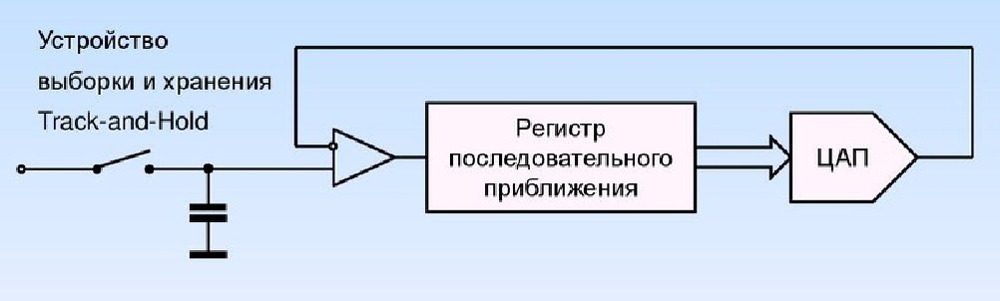
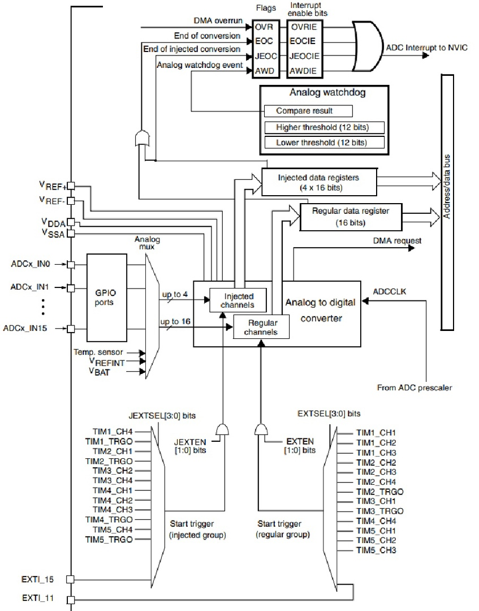
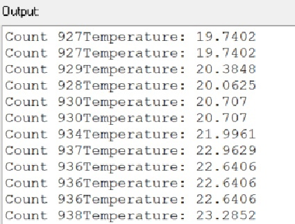

:figure-caption: Рисунок
:table-caption: Таблица
:toc:
:toc-title: Оглавление:

== Задание

1. Измерить температуру микроконтроллера с помощью АЦП и инженекторных каналов.***
2. Для перевода кода АЦП в температуру использовать калибровочный точки, указанные в datasheet на микроконтроллер. Там указан, адреса двух точке, по которым лежат значения кодов температуры при 110 и 30 градусах цельсия.
3. Вывести полученное значение в терминал по UART.

== Основные харатеристика АЦП
* Разрешение
** Разрядность
** Эффективная разрядность
* Передаточная характеристика АЦП
* Точность
* Нелинейность
* Ошибки квантования
* Частота дискретизации

== АЦП последовательного преобразования

Ацп последовательного приближения работает методу половинного деления.

== АЦП микроконтроллера STM32F411

АЦП(макс 12 разрядов) микроконтроллера STM32F411 работает по принципу последовательного приближения.

* Основные элементы АЦП:
** Наличие регулярных и инжектированных каналов – отличие только в том, что инжектированные каналы могут писать данные в 4 регистра с 4 каналов сразу, а регулярный только в один регистр
** 19 аналоговых каналов, 16 из которых которые могут сконфигурированы на работу от внешних источников или 3 внутренних.
** Внешние каналы поступают на мультиплексор, где выбирается только один из них. Т.е. в один момент времени может быть измерено напряжение только с одного канала.
** Результат преобразования сохраняется в регистрах данных. Для регулярных каналов это только один 16 битный регистр. Для инжектированных – 4.
** Запуск преобразования может быть как программным, так и внешним. Внешний запуск может происходить от таймеров или с двух внешних входов.

== Схема АЦП микроконтроллера STM32F411

== Режим одиночного преобразования

В этом режиме АЦП находится сразу после сброса. Бит CONT регистра ADC_CR2 равен 0.

* Для начала работы с АЦП в этом режиме нужно
** Настроить нужный порт, подключенный к нужному каналу АЦП на аналоговый вход
** Подать тактирование на АЦП
** Выбрать нужный канал для измерения
** Настроить канал АЦП на нужную частоту преобразования
** Включить АЦП
** Начать преобразование
** Дождаться флага готовности преобразования
** Считать преобразованное значение

== Работа с программой 1

[source, c++]
#include "adc1registers.hpp" //for ADC1
#include "adccommonregisters.hpp" //for ADCCommon
#include "gpioaregisters.hpp" //for Gpioa
#include "gpiocregisters.hpp" //for Gpioc
#include "rccregisters.hpp" //for RCC
#include "tim2registers.hpp" //for TIM2
#include <iostream>
extern "C"
{
int __low_level_init(void)
{
 RCC::CR::HSEON::On::Set() ;
 while (!RCC::CR::HSERDY::Ready::IsSet())
 {
 }
 RCC::CFGR::SW::Hse::Set() ;
 while (!RCC::CFGR::SWS::Hse::IsSet())
 {
 }
 RCC::APB2ENR::ADC1EN::Enable::Set();
 ADC_Common::CCR::TSVREFE::Enable::Set();
 ADC1::JSQR::JSQ4::Channel18::Set();
 ADC1::CR1::RES::Bits12::Set();
 ADC1::CR2::CONT::SingleConversion::Set();
 ADC1::CR2::EOCS::SingleConversion::Set();
 ADC1::SMPR1::SMP18::Cycles84::Set();
 ADC1::JSQR::JL::Set(0x00);
 ADC1::JSQR::JSQ4::Set(18);
 return 1;
}
}
constexpr float B1 = (25.0F - 0.76F/0.0025F); // see datacheet (page 226) and calculate B coeficient here ;
constexpr float K1 = (3.3F/4096.0F)/0.0025F ; // see datcheet ((page 226)) and calculate K coeficient here ;
int main()
{
uint32_t data = 0U ;
float temperature = 0.0F ;
 ADC1::CR2::ADON::Set(1);
 for(;;)
 {
 ADC1::CR2::JSWSTART::On::Set();
 while(ADC1::SR::JEOC::ConversionNotComplete::IsSet())
 {
}
 data = ADC1::JDR1::Get();
 temperature = static_cast<float>(data) * K1 + B1 ; //Convert ADC counts to temperature
 std::cout << "Count " << data << "Temperature: " << temperature << std::endl ;
 }
}

== Работа с программой 2

Подключаем необходимые библиотек, после чего настраиваем передачу по UART, а также производим настройку АЦП для измерения температуры, после преобразовываем значение температуры и выводим его по интерфейсу.

[source, c++]
#include "gpioaregisters.hpp"  //for Gpioa
#include "gpiocregisters.hpp"  //for Gpioc
#include "gpiobregisters.hpp"  //for Gpiob
#include "rccregisters.hpp"    //for RCC
#include "tim2registers.hpp"   //for SPI2
#include "nvicregisters.hpp"   //for NVIC
#include "usart2registers.hpp" //for USART2
#include "adc1registers.hpp" //for ADC1
#include "adccommonregisters.hpp" //for ADCCommon
#include <iostream>
#include <string>
#include <sstream>
#include <iomanip>
using namespace std ;
extern "C"
{
 int __low_level_init(void)
 {
 RCC::CR::HSION::On::Set() ;
 while (!RCC::CR::HSIRDY::Ready::IsSet())
 {
 }
 RCC::CFGR::SW::Hsi::Set() ;
 while (!RCC::CFGR::SWS::Hsi::IsSet())
 {
 }
   //Switch on clock on ADC1
   RCC::APB2ENR::ADC1EN::Enable::Set();
   //Switch On internal tempearture sensor
   ADC_Common::CCR::TSVREFE::Set(1U);
   ADC1::JSQR::JSQ4::Set(1U);
   //Set single conversion mode
   ADC1::CR1::RES::Set(0U);
   ADC1::CR2::CONT::Set(1U);
   ADC1::CR2::EOCS::Set(0U);
   // Set 84 cycles sample rate for channel 18
   ADC1::SMPR1::SMP18::Set(4U);
   // Set laentgh of conversion sequence to 1
   ADC1::JSQR::JL::Set(0x00);
   // Connect first conversion on Channel 18
   ADC1::JSQR::JSQ4::Set(18U);
   RCC::AHB1ENR::GPIOAEN::Enable::Set();
   // Постра а в альтернативныей режим
   GPIOA::MODER::MODER2::Alternate::Set();
   GPIOA::MODER::MODER3::Alternate::Set();
   GPIOA::AFRL::AFRL2::Af7::Set(); //Tx usart2
   GPIOA::AFRL::AFRL3::Af7::Set(); //Rx usart2
   //Подключить usart2 к шине тактирования
   RCC::APB1ENR::USART2EN::Enable::Set();
   USART2::CR1::OVER8::OversamplingBy16::Set();
   USART2::CR1::M::Data8bits::Set();
   USART2::CR1::PCE::ParityControlDisable::Set();
   USART2::BRR::Write(16'000'000/(9600));
   USART2::CR1::UE::Enable::Set();
   return 1;
 }
}
int main()
{
  uint32_t data = 0U ;
  const char* temper = " ";
  float temperature = 0.0F ;
  uint16_t *B1 = (uint16_t *)0x1FFF7A2C;
  uint16_t *K1 = (uint16_t *)0x1FFF7A2E;
  string temp;
  ADC1::CR2::ADON::Set(1);
  uint16_t Tmin=((uint16_t)0x1FFF);
  USART2::CR1::TE::Enable::Set();
  for(;;)
  {
       //Start conversion
    ADC1::CR2::JSWSTART::Set(1U);
    // wait until Conversion is not complete
    while(ADC1::SR::JEOC::Value0::IsSet())
    {
    }
    //Get data from ADC
    data = ADC1::JDR1::Get();
    temperature = (((float)(110-30)/(*K1-*B1)*((float)data - *B1))+30) ; //Convert ADC counts to temperature
    temp = to_string(temperature);
    temp.insert(0, "Temperatura: ");
    temp.append("       ");
    tempout = temp.c_str();
    USART2::DR::Write(*ptr);
    while(USART2::SR::TXE::DataRegisterNotEmpty::IsSet())
    {
    }
     ptr++;
    if(*ptr == 0)
    {
      ptr=tempout;
       for(int i=0;i<1000000;i++)
       {
       }
    }
  }
  return 0 ;
}

== Результат 1 

Начальные значения на рисунке показывают значение температуры в квартире. Далее мы начали нагревать.

== Результат 2

image::4.jpg[]
